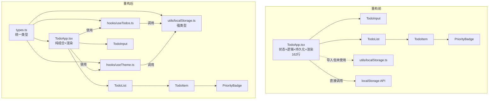

## 用户需求

对当前 TodoList 项目进行全面的代码质量评审与架构优化，发现并修复所有问题。

## 产品概述

一个基于 React 的待办事项管理应用，支持任务增删改、完成状态切换、优先级标记、明暗主题切换，数据持久化至 localStorage。

## 核心功能修复与优化

### BUG 修复

- 修复 localStorage 持久化竞态条件：初始挂载时空数组覆盖已保存数据
- 修复 `Date.now().toString()` 作为 ID 可能重复的问题
- 修复 `AnimatePresence mode="wait"` 导致列表动画阻塞
- 修复暗色主题不生效（CSS 硬编码颜色值未使用 CSS 变量）

### 架构优化

- 统一 `Todo` 类型定义，消除 3 处重复定义（TodoApp/TodoItem/TodoList 各有一份，且 TodoList 版本缺少字段）
- 重构 TodoApp 组件：使用已有的 localStorage 工具函数替代内联操作，抽取自定义 Hook
- 使用函数式更新 `setTodos(prev => ...)` 避免闭包陈旧引用
- 将 `priorityConfig` 提升至组件外部避免每次渲染重建

### 代码清理

- 删除不存在的 Tag 组件的测试文件 `Tag.test.tsx`
- 删除 Vite 模板默认样式 `index.css` 中的冲突样式
- 清理未使用的 CSS 动画（fadeInUp、scaleIn）和重复 body 样式定义
- 移除 localStorage.ts 中的死代码函数（saveFilters/loadFilters/saveTags/loadTags）
- 移除 `defaultTags` 未使用变量、未使用的导入

### 测试修复

- 修复 PriorityBadge 测试中错误的颜色断言（断言 `#e53e3e` 但组件使用 `rgba(229, 62, 62, 0.1)`）
- 启用并修复被跳过的 TodoApp 集成测试和 localStorage 单元测试
- 删除引用不存在组件的 Tag.test.tsx

### 配置修正

- 修复 Tailwind CSS v4 集成（v3 的 `@tailwind` 指令在 v4 中无效）
- 移除未使用的 devDependencies（ts-jest、vite-tsconfig-paths）
- 修正 index.html 标题
- localStorage.ts 消除 `any` 类型，使用正确的泛型

## 技术栈

- 前端框架：React 19 + TypeScript 5.9
- 构建工具：Vite 7
- 动画：framer-motion 12
- 样式：CSS（移除无效的 Tailwind v4 集成，保持纯 CSS 方案）
- 测试：Jest 29 + Testing Library + babel-jest

## 实现方案

### 整体策略

采用分层重构策略：先统一类型定义和工具层，再重构核心状态管理逻辑，最后修复样式和测试。每一步确保不破坏现有功能。

### 关键技术决策

**1. 类型统一 - 新建 `src/types.ts`**
将 `Todo` 接口和 `Priority` 类型提取到独立类型文件，所有组件和工具函数统一引用。这消除了 3 处重复定义和 TodoList 中缺少 `priority`/`tags` 字段的类型不一致问题。

**2. 自定义 Hook 抽取 - 新建 `src/hooks/useTodos.ts` 和 `src/hooks/useTheme.ts`**
将 TodoApp 中 162 行的集中式状态管理拆分为两个自定义 Hook：

- `useTodos`：封装 todos 的 CRUD 操作和 localStorage 持久化，包含 `isInitialized` 标志位解决竞态条件
- `useTheme`：封装主题切换和持久化逻辑

这样 TodoApp 只保留组合和渲染职责，符合 SoC 原则。

**3. localStorage 工具函数重构**

- 消除所有 `any` 类型，为 `saveTodos`/`loadTodos` 使用 `Todo[]` 泛型
- 移除死代码（saveFilters/loadFilters/saveTags/loadTags）
- TodoApp 中删除内联 localStorage 操作，统一使用工具函数

**4. 持久化竞态修复**
在 `useTodos` Hook 中引入 `isInitialized` ref 标志位：

- 初始化 effect 从 localStorage 加载数据后设为 true
- 保存 effect 检查标志位，仅在初始化完成后才执行持久化
- 使用 `useRef` 而非 `useState` 避免额外渲染

**5. ID 生成策略**
将 `Date.now().toString()` 替换为 `crypto.randomUUID()`，该 API 在所有现代浏览器中已广泛支持，且 tsconfig 中 lib 包含 DOM。

**6. CSS 样式修复**

- 移除 `App.css` 顶部无效的 `@tailwind` 指令（Tailwind CSS v4 不使用此语法，且项目实际未配置 Tailwind PostCSS 管道）
- 将所有硬编码颜色值替换为 CSS 变量引用（`var(--text-primary)` 等），使暗色主题生效
- 删除第 339 行重复的 `body` 样式块，将 `gradientFlow` 动画合并到首个 body 定义
- 移除未使用的 `fadeInUp`、`scaleIn` CSS 动画及对应类名
- 清空或删除 `index.css` 中 Vite 模板默认样式，避免与 App.css 冲突

**7. AnimatePresence 修复**
将 TodoList 中 `<AnimatePresence mode="wait">` 改为 `<AnimatePresence mode="popLayout">`，`mode="wait"` 会导致列表中的子元素必须等前一个退出动画结束才能执行，在列表场景中表现为卡顿。`popLayout` 允许退出和进入动画并行。

**8. 测试修复策略**

- 删除 `Tag.test.tsx`（引用不存在的组件）
- PriorityBadge 测试：修正断言从 `background-color: #e53e3e` 为 `background-color: rgba(229, 62, 62, 0.1)`（与组件实际输出一致）
- TodoApp.test.tsx：重构为使用 Hook 后的集成测试，移除 `describe.skip`，mock localStorage 工具函数
- localStorage.test.ts：移除 `describe.skip`，修复 jsdom 环境下的 mock 策略

## 实现注意事项

### 性能

- `priorityConfig` 对象从 PriorityBadge 组件内移至模块顶层，避免每次渲染重建
- `addTodo`/`toggleTodo`/`deleteTodo` 使用函数式更新 `setTodos(prev => ...)` 避免闭包陈旧引用，同时移除对 `todos` 的依赖
- 移除 `useCallback` 包装的 `persistTodos`/`persistTheme`（在 Hook 抽取后不再需要，直接在 useEffect 中调用工具函数）

### 向后兼容

- localStorage 存储格式保持不变（`todos_v1` key + `{version, timestamp, data}` 结构），确保已有用户数据不丢失
- 所有组件的 props 接口保持兼容

### 爆炸半径控制

- 类型文件是纯新增，不改变运行时行为
- Hook 抽取仅改变代码组织，不改变功能逻辑
- CSS 变量替换逐一对照，确保亮色模式视觉不变

## 架构设计

### 重构前后对比



### 数据流

```
用户操作 -> useTodos Hook (状态更新) -> React 重渲染 -> useEffect (isInitialized 检查) -> localStorage 工具函数 -> 浏览器存储
页面加载 -> useTodos Hook (初始化 effect) -> localStorage 工具函数 -> 读取数据 -> setTodos -> 设置 isInitialized
```

## 目录结构

```
src/
├── types.ts                        # [NEW] 统一类型定义。定义 Todo 接口（id/text/completed/priority/tags）、Priority 类型、Theme 类型。所有组件和 hooks 统一引用此文件。
├── hooks/
│   ├── useTodos.ts                 # [NEW] Todo 状态管理 Hook。封装 todos 的 CRUD（add/toggle/delete）、localStorage 持久化（含 isInitialized 竞态保护）、统计计算。使用 crypto.randomUUID() 生成 ID，函数式更新 setTodos。
│   └── useTheme.ts                 # [NEW] 主题管理 Hook。封装 theme 状态、toggleTheme、localStorage 持久化、document.documentElement data-theme 属性同步。
├── components/
│   ├── TodoApp.tsx                 # [MODIFY] 精简为纯组合组件。移除所有内联状态管理和 localStorage 操作，改为调用 useTodos 和 useTheme Hooks。移除未使用的 localStorage 导入。
│   ├── TodoInput.tsx               # [不变] 无需修改
│   ├── TodoList.tsx                # [MODIFY] 修复 AnimatePresence mode 从 "wait" 改为 "popLayout"。修复 Todo 类型导入使用统一类型（添加 priority/tags 字段）。
│   ├── TodoItem.tsx                # [MODIFY] 移除本地 Todo 接口定义，改为从 types.ts 导入。移除未使用的 defaultTags 变量。
│   ├── PriorityBadge.tsx           # [MODIFY] 将 priorityConfig 常量提升到组件外部。Priority 类型从 types.ts 导入。
│   ├── Tag.test.tsx                # [DELETE] 测试引用不存在的 Tag 组件，直接删除。
│   ├── TodoApp.test.tsx            # [MODIFY] 移除 describe.skip，重写为对 useTodos/useTheme Hook 整合后的集成测试，mock localStorage 工具函数。
│   ├── TodoInput.test.tsx          # [不变] 测试正常
│   ├── TodoItem.test.tsx           # [不变] 测试正常
│   ├── TodoList.test.tsx           # [不变] 测试正常
│   └── PriorityBadge.test.tsx      # [MODIFY] 修正颜色断言：backgroundColor 从 #e53e3e 改为 rgba(229, 62, 62, 0.1)，其他优先级同理。
├── utils/
│   ├── localStorage.ts             # [MODIFY] 移除所有 any 类型，saveTodos/loadTodos 参数和返回值使用 Todo[] 类型。移除死代码函数 saveFilters/loadFilters/saveTags/loadTags 及对应的 STORAGE_KEYS。
│   └── localStorage.test.ts        # [MODIFY] 移除 describe.skip，修复 jsdom 下 localStorage mock 策略。移除对已删除函数的测试用例。
├── App.tsx                         # [MODIFY] 移除 index.css 导入（该文件将被删除或清空）。
├── App.css                         # [MODIFY] 移除无效的 @tailwind 指令；所有硬编码颜色替换为 CSS 变量；删除重复 body 块和未使用的 CSS 动画。
├── index.css                       # [DELETE] Vite 模板默认样式与 App.css 冲突，删除该文件。
├── main.tsx                        # [MODIFY] 移除对 index.css 的导入。
├── assets/react.svg                # [DELETE] 未使用的静态资源。
└── setupTests.ts                   # [不变]
index.html                          # [MODIFY] title 从 "todolist" 改为 "Todo List"。
package.json                        # [MODIFY] 移除未使用的 devDependencies：ts-jest、vite-tsconfig-paths。
```

## 关键代码结构

### 统一类型定义 (src/types.ts)

```typescript
export type Priority = 'high' | 'medium' | 'low';
export type Theme = 'light' | 'dark';

export interface Todo {
  id: string;
  text: string;
  completed: boolean;
  priority?: Priority;
  tags?: string[];
}
```

### useTodos Hook 签名 (src/hooks/useTodos.ts)

```typescript
interface UseTodosReturn {
  todos: Todo[];
  addTodo: (text: string) => void;
  toggleTodo: (id: string) => void;
  deleteTodo: (id: string) => void;
  completedCount: number;
  totalCount: number;
}

export function useTodos(): UseTodosReturn;
```

### useTheme Hook 签名 (src/hooks/useTheme.ts)

```typescript
interface UseThemeReturn {
  theme: Theme;
  toggleTheme: () => void;
}

export function useTheme(): UseThemeReturn;
```

## Agent Extensions

### Skill

- **writing-plans**
- 用途：本任务已通过 writing-plans 流程完成需求分析和方案设计，输出结构化的实施计划
- 预期结果：产出完整的、可直接执行的重构方案

- **executing-plans**
- 用途：在后续执行阶段，按计划步骤逐项实施，确保每一步都经过验证
- 预期结果：所有重构项按顺序实施，每步有检查点确认不引入回归

- **verification-before-completion**
- 用途：在每个关键步骤完成后，运行 TypeScript 编译检查和测试套件，确认无回归
- 预期结果：`tsc -b` 无报错、`jest` 全部通过

- **test-driven-development**
- 用途：修复测试时遵循 TDD 原则，先修正断言，再确认通过
- 预期结果：所有测试启用且通过，断言与组件实际输出一致

### SubAgent

- **code-explorer**
- 用途：在实施过程中若需确认某个符号的引用链或依赖关系，使用此 subagent 进行跨文件搜索
- 预期结果：准确定位所有需要修改的引用点，防止遗漏