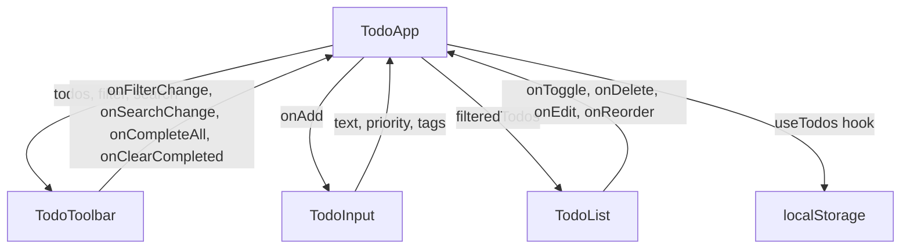

## 产品概述

为现有 TodoList 项目增加 7 个核心功能，将其从基础待办应用升级为功能完善的任务管理工具。

## 核心功能

### 1. 设置优先级

- 添加 Todo 时可选择优先级（高/中/低），默认为"中"
- 输入框旁显示优先级选择器（下拉或按钮组）
- 已有的 `PriorityBadge` 组件在 TodoItem 中正确显示所选优先级

### 2. 标签系统

- 添加 Todo 时可输入标签（逗号分隔或按 Enter 添加标签）
- 每个 Todo 项下方以彩色标签芯片形式展示关联标签
- 编辑时可修改标签

### 3. 编辑待办事项

- 双击 Todo 文本或点击编辑按钮进入编辑模式
- 编辑模式下文本变为输入框，可修改文字、优先级、标签
- 按 Enter 保存，按 Escape 取消编辑

### 4. 筛选功能

- 提供"全部"/"未完成"/"已完成"三个筛选标签按钮
- 切换筛选条件时列表内容动态更新
- 当前选中的筛选标签有高亮样式

### 5. 搜索功能

- 在列表上方提供搜索输入框
- 实时过滤显示包含关键词的 Todo 项
- 搜索为空时显示全部

### 6. 批量操作

- "全部完成"按钮：一键将所有未完成项标为完成
- "清除已完成"按钮：一键删除所有已完成项
- 按钮置于统计栏区域，无可操作项时禁用

### 7. 拖拽排序

- 用户可通过拖拽 Todo 项来自定义排列顺序
- 拖拽时有视觉反馈（透明度变化、占位符）
- 新顺序自动持久化到 localStorage

## 技术栈

- **前端框架**: React 19 + TypeScript（现有）
- **构建工具**: Vite 7（现有）
- **动画库**: Framer Motion 12（现有）
- **样式方案**: 纯 CSS + CSS 变量（现有，沿用主题系统）
- **测试**: Jest 29 + React Testing Library（现有）
- **拖拽**: HTML5 原生 Drag and Drop API（零依赖，framer-motion v12 已移除 Reorder 组件）

## 实现方案

### 整体策略

以现有的 `useTodos` hook 为核心扩展点，所有新功能的状态逻辑集中在此 hook 内管理，保持单一数据源。筛选和搜索作为派生状态（computed）在 hook 内计算，不额外存储。组件层面沿用现有的单向数据流模式：`TodoApp` 作为容器组件，通过 props 向下传递数据和回调。

### 关键技术决策

1. **`addTodo` 签名扩展**：从 `addTodo(text)` 改为 `addTodo(text, priority?, tags?)`，向后兼容，不设置 priority/tags 时行为与之前一致。

2. **筛选和搜索的实现**：在 `useTodos` hook 中新增 `filter`（`'all' | 'active' | 'completed'`）和 `searchQuery` 状态，通过 `useMemo` 计算 `filteredTodos`，避免每次渲染重复计算。筛选和搜索不持久化，刷新后重置为默认值。

3. **编辑功能**：在 `useTodos` 中新增 `editTodo(id, updates)` 方法，`TodoItem` 组件内部管理编辑模式状态（`isEditing`），保持组件自治。

4. **拖拽排序**：使用 HTML5 原生 Drag and Drop API 实现，不引入额外依赖。在 `useTodos` 中新增 `reorderTodos(fromIndex, toIndex)` 方法，直接操作 `todos` 数组顺序。拖拽操作在 `TodoList` 组件层处理事件，通过回调更新 hook 状态。

5. **标签系统**：在 `TodoInput` 中增加标签输入区域（输入框 + 芯片显示），标签以 `string[]` 存储。`TodoItem` 中以彩色芯片展示标签。

6. **`isValidTodo` 无需修改**：现有的 `localStorage.ts` 中 `isValidTodo` 只校验核心字段（`id`, `text`, `completed`），`priority` 和 `tags` 是可选字段，现有逻辑已兼容。

### 性能考虑

- 筛选/搜索使用 `useMemo` 依赖 `[todos, filter, searchQuery]`，仅在依赖变化时重新计算。
- `editTodo`、`reorderTodos` 等新方法使用 `useCallback` 包裹，避免子组件不必要的重渲染。
- 拖拽过程中使用 CSS `transform` 和 `opacity` 变化实现视觉反馈，不触发布局重排。

## 实现注意事项

1. **向后兼容**：`addTodo` 的 `priority` 和 `tags` 参数设为可选，不影响现有调用点。localStorage 中旧格式数据（无 priority/tags 字段）由 `isValidTodo` 正常通过。

2. **拖拽与动画冲突**：现有 `TodoItem` 使用 `motion.li` 带 spring 动画。拖拽时需要在拖拽状态下禁用 `motion.li` 的入场动画（通过 `layout` 属性或条件渲染），避免拖拽释放后触发不自然的弹跳。

3. **筛选状态下的拖拽**：当筛选或搜索激活时（非"全部"视图），禁用拖拽排序功能，因为此时列表只是子集，拖拽排序语义不明确。通过 `isDragEnabled` 计算属性控制。

4. **搜索防抖**：搜索输入使用受控组件即时过滤（数据量小，无需 debounce）。如果未来数据量增大可加 `useDeferredValue`。

5. **测试策略**：现有测试中 `TodoList.test.tsx` mock 了 `TodoItem`，`TodoApp.test.tsx` mock 了 `localStorage`。新增功能测试沿用相同模式，确保测试隔离。

## 架构设计

### 数据流



### 组件职责变更

- **TodoApp**：新增 `TodoToolbar` 渲染，传递筛选/搜索/批量操作相关 props
- **TodoInput**：扩展为支持优先级选择和标签输入
- **TodoList**：新增拖拽排序事件处理，接收 `onReorder` 和 `onEdit` 回调
- **TodoItem**：新增编辑模式、标签显示、拖拽手柄
- **TodoToolbar（新组件）**：搜索框 + 筛选按钮 + 批量操作按钮

## 目录结构

```
src/
├── types.ts                            # [MODIFY] 新增 FilterType 类型定义：'all' | 'active' | 'completed'
├── hooks/
│   └── useTodos.ts                     # [MODIFY] 核心扩展：addTodo 支持 priority/tags 参数；新增 editTodo、reorderTodos、completeAll、clearCompleted 方法；新增 filter/searchQuery 状态和 filteredTodos 计算属性
├── components/
│   ├── TodoApp.tsx                     # [MODIFY] 集成 TodoToolbar 组件；将 filteredTodos 传递给 TodoList；传递编辑、排序、批量操作回调
│   ├── TodoInput.tsx                   # [MODIFY] 扩展 onAdd 签名接收 priority 和 tags；新增优先级选择器（三个按钮组）和标签输入区域（输入框 + 芯片列表）
│   ├── TodoItem.tsx                    # [MODIFY] 新增编辑模式（双击文本触发）；编辑时显示文本输入框、优先级选择、标签编辑；新增标签芯片展示；新增拖拽手柄和 HTML5 drag 属性；所有优先级均显示 PriorityBadge
│   ├── TodoList.tsx                    # [MODIFY] 新增拖拽排序逻辑（dragstart/dragover/drop 事件处理）；接收 onEdit 和 onReorder 回调并传递给子组件；筛选模式下禁用拖拽
│   ├── TodoToolbar.tsx                 # [NEW] 工具栏组件：包含搜索输入框、筛选按钮组（全部/未完成/已完成）、批量操作按钮（全部完成/清除已完成）；接收 filter、searchQuery、统计数据等 props
│   ├── TagChip.tsx                     # [NEW] 标签芯片组件：根据标签文本生成稳定的颜色（哈希算法映射到预设色板），显示标签名称，可选删除按钮（编辑模式下）
│   ├── TodoToolbar.test.tsx            # [NEW] TodoToolbar 单元测试：覆盖筛选切换、搜索输入、批量操作按钮点击和禁用状态
│   ├── TagChip.test.tsx                # [NEW] TagChip 单元测试：覆盖标签渲染、颜色生成一致性、删除按钮回调
│   ├── TodoApp.test.tsx                # [MODIFY] 补充新功能集成测试：优先级设置、编辑、筛选、搜索、批量操作
│   ├── TodoInput.test.tsx              # [MODIFY] 补充优先级选择和标签输入测试
│   ├── TodoItem.test.tsx               # [MODIFY] 补充编辑模式、标签显示、拖拽属性测试
│   └── TodoList.test.tsx               # [MODIFY] 补充拖拽排序测试
├── utils/
│   └── localStorage.ts                 # [NO CHANGE] 现有持久化逻辑已兼容 priority/tags 可选字段，无需修改
└── App.css                             # [MODIFY] 新增样式：工具栏（搜索框、筛选按钮组、批量操作按钮）、标签芯片、编辑模式输入框、拖拽视觉反馈（拖拽手柄、占位符、透明度）、优先级选择器按钮组
```

## 关键代码结构

```typescript
// types.ts - 新增类型
export type FilterType = 'all' | 'active' | 'completed';

// useTodos hook - 扩展后的接口签名
interface UseTodosReturn {
  todos: Todo[];
  filteredTodos: Todo[];
  filter: FilterType;
  searchQuery: string;
  setFilter: (filter: FilterType) => void;
  setSearchQuery: (query: string) => void;
  addTodo: (text: string, priority?: Priority, tags?: string[]) => void;
  editTodo: (id: string, updates: Partial<Pick<Todo, 'text' | 'priority' | 'tags'>>) => void;
  toggleTodo: (id: string) => void;
  deleteTodo: (id: string) => void;
  reorderTodos: (fromIndex: number, toIndex: number) => void;
  completeAll: () => void;
  clearCompleted: () => void;
  completedCount: number;
  totalCount: number;
}
```

## 设计风格

沿用现有项目的毛玻璃（Glassmorphism）设计风格，保持与 light/dark 主题系统的一致性。新增组件延续半透明背景、柔和边框、圆角卡片、微妙阴影的设计语言。所有交互元素添加平滑过渡动画（0.3s cubic-bezier）。

## 页面设计（单页应用，新增区块）

### 区块1：输入区（TodoInput 扩展）

- 保持现有文本输入框 + Add 按钮的横向布局不变
- 文本输入框下方新增一行：左侧为优先级按钮组（High/Medium/Low 三个胶囊按钮，选中态有对应优先级颜色填充），右侧为标签输入小输入框
- 标签输入框下方以横向滚动的彩色芯片形式展示已添加的标签，每个芯片带 x 关闭按钮
- 优先级按钮组默认选中 Medium，使用浅灰底色+深色文字；选中态：High 红色渐变、Medium 橙色渐变、Low 绿色渐变

### 区块2：工具栏（TodoToolbar 新增）

- 位于输入区下方、列表上方
- 左侧：搜索输入框，圆角毛玻璃样式，带搜索图标（放大镜 Unicode），宽度约50%
- 右侧：三个筛选胶囊按钮（All / Active / Done），未选中态为半透明背景，选中态为主题强调色填充 + 白色文字
- 下方一行：两个操作按钮（Complete All / Clear Completed），小尺寸次要按钮样式，禁用态降低透明度
- 整体使用 flex 布局，间距与现有卡片一致

### 区块3：待办列表（TodoItem 扩展）

- 保持现有卡片样式不变
- 每个卡片左侧新增拖拽手柄图标（六点网格 Unicode），颜色为 text-muted，悬停时变为 text-secondary
- Checkbox 右侧依次为：优先级徽章（所有优先级均显示）、文本、标签芯片（如有）
- 标签芯片为小号圆角胶囊，每个标签颜色由标签名哈希决定，从预设的 8 色柔和色板中取色
- 编辑模式：双击文本后，文本区域变为输入框（复用输入框样式），下方展开优先级选择和标签编辑区，带 Save/Cancel 按钮
- 拖拽中的项目透明度降至 0.5，拖拽目标位置显示 2px 主题强调色分隔线

### 区块4：统计栏（现有扩展）

- 保持现有居中统计文本
- 样式不变

### 响应式适配（768px 以下）

- 工具栏改为纵向堆叠：搜索框占满宽度，筛选按钮组和操作按钮各自成行
- 输入区优先级和标签输入纵向堆叠
- 拖拽手柄始终可见（移动端无 hover）

## Agent Extensions

### Skill

- **test-driven-development**
- Purpose: 在实现每个功能模块前先编写测试用例，确保功能正确性和回归安全
- Expected outcome: 每个新功能和修改的组件都有对应的测试覆盖，所有测试通过

- **verification-before-completion**
- Purpose: 在完成所有功能后运行全量测试和构建验证，确保没有回归
- Expected outcome: 全部测试通过，构建成功，无 lint 错误

- **subagent-driven-development**
- Purpose: 将独立的功能实现任务分发给子代理并行执行，提高效率
- Expected outcome: 多个独立功能模块同时开发完成