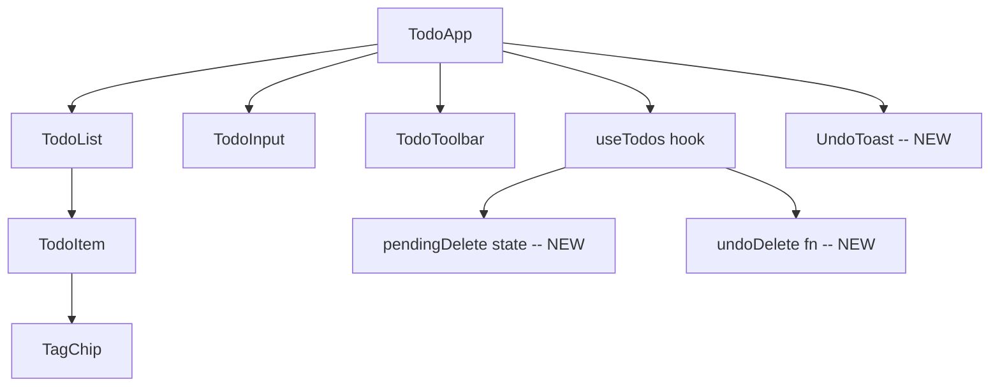

## 用户需求

修复 TodoList 项目审查中发现的 6 个高优先级体验问题。

## 产品概述

对现有 TodoList 应用进行多项用户体验增强，涵盖误操作保护、编辑一致性、键盘可访问性、搜索便利性、语言统一和暗色主题视觉优化。

## 核心功能

1. **删除撤销机制** -- 删除待办项后不立即永久删除，而是显示一个限时撤销通知条（Toast），允许用户在倒计时内撤回误删操作；倒计时结束后真正删除
2. **编辑模式标签 onBlur 补齐** -- TodoItem 编辑模式下的标签输入框在失焦时自动提交当前输入的标签，与 TodoInput 行为保持一致，防止用户输入标签后直接点 Save 导致标签丢失
3. **操作按钮键盘可访问** -- 当 todo 卡片内的按钮获得键盘焦点时（`:focus-within`），编辑和删除按钮应与 hover 一样可见
4. **搜索框清除按钮** -- 搜索框在有内容时，右侧出现一个清除按钮，点击后一键清空搜索词
5. **UI 语言统一为英文** -- 将重复添加警告和标签上限提示从中文改为英文，与应用其余 UI 文案保持一致
6. **Dark 模式标签颜色优化** -- TagChip 在暗色主题下使用高亮度文字色和更高透明度的背景色，确保在深色卡片上清晰可辨

## 技术栈

- 前端框架：React 19 + TypeScript 5.9
- 构建工具：Vite 7
- 样式：Less（全局 `App.less`）
- 动画：Framer Motion 12
- 测试：Jest 29 + Testing Library
- 已有主题系统：CSS 自定义属性（`data-theme` 属性切换 light/dark）

## 实现方案

### 1. 删除撤销机制

**策略**：采用 "软删除 + Toast 倒计时" 模式。在 `useTodos` 中将 `deleteTodo` 改为先将被删项暂存到 `pendingDelete` 状态并从列表中移除，同时启动一个倒计时（5 秒）。倒计时内用户可点击 Undo 将项目恢复到列表中；倒计时结束后清除暂存。新建 `UndoToast` 组件展示在页面底部。

**关键决策**：

- 使用 `useRef` 存 timeout ID，便于取消
- `pendingDelete` 存储 `{ todo, index }` 以保留原位置，恢复时精确插回
- Toast 使用 Framer Motion `AnimatePresence` 实现进出动画，与项目现有动画体系一致
- 连续删除时，前一个 pending 立即永久删除（被挤掉），只保留最新一个的撤销机会

### 2. 编辑模式标签 onBlur

**策略**：在 `TodoItem` 编辑模式的 tag input 上添加 `onBlur` 处理，提取与 `handleTagKeyDown` 中相同的 "提交当前输入" 逻辑为 `commitTagInput` 函数复用。`saveEdit` 内也调用 `commitTagInput` 确保点 Save 时收割残留输入。

### 3. 操作按钮键盘可访问

**策略**：在 `App.less` 中 `.todo-item-actions` 的展开规则里，除 `.todo-item:hover &` 外，增加 `.todo-item:focus-within &` 选择器。按钮内部的 `button` 同理增加 `:focus-within` 匹配。

### 4. 搜索框清除按钮

**策略**：在 `TodoToolbar` 的搜索框内，当 `searchQuery` 非空时渲染一个清除按钮（`x`），点击调用 `onSearchChange('')`。样式上放在输入框右侧，用淡入动画。

### 5. UI 语言统一

**策略**：将 3 处中文文案替换为英文：

- `TodoInput` 第 30 行：`"xxx" 已存在，请勿重复添加` -> `"xxx" already exists`
- `TodoInput` 第 104 行：`最多 ${MAX_TAGS} 个标签` -> `Max ${MAX_TAGS} tags`
- `TodoItem` 第 156 行：`最多 ${MAX_TAGS} 个标签` -> `Max ${MAX_TAGS} tags`
- 同步更新 `TodoInput.test.tsx` 第 113 行的断言文本

### 6. Dark 模式标签颜色优化

**策略**：在 `TagChip` 中提供 light/dark 双套颜色配置。通过 `useTheme` 或读取 `document.documentElement.dataset.theme` 判断当前主题。考虑到 TagChip 是纯展示组件且要避免引入 hook 依赖，采用 CSS 变量方案：标签的 `color` 和 `backgroundColor` 改为通过 CSS 自定义属性注入（`style` 中设置 `--tag-color` / `--tag-bg`），`.tag-chip` 样式引用这些变量。dark 主题下通过 `:root[data-theme='dark'] .tag-chip` 覆盖对比度。

更简洁的方案：直接在 TagChip 中提供两套 TAG_COLORS（light 和 dark），通过读取当前 DOM 的 `data-theme` 属性选择对应颜色组。由于 TagChip 在主题切换时会随父组件重渲染，这个读取是实时的。

**Dark 模式颜色选择原则**：文字色使用高明度饱和色（如 `#a78bfa` 代替 `#5b21b6`），背景色提高到 20% 不透明度以在深色卡片上可见。

## 实现注意事项

- **撤销机制的 localStorage 同步**：`pendingDelete` 的 todo 从 `todos` 数组移除后会立即触发 `saveTodos`，撤销恢复时也会重新保存。这确保了在倒计时期间刷新页面，被删项不会意外恢复（符合预期）。
- **性能**：`UndoToast` 是独立组件，倒计时状态变化不影响 todo 列表重渲染。
- **测试更新**：现有 `TodoItem.test.tsx` 第 68 行测试 "click delete calls onDelete"，改为 `deleteTodo` 内部是软删除后此测试仍验证回调调用，不受影响。`TodoInput.test.tsx` 的 duplicate warning 断言文本需同步更新为英文。

## 架构设计

修改范围在现有架构内：



核心变更点：

- `useTodos` 新增 `pendingDelete` 状态和 `undoDelete` 方法
- `TodoApp` 渲染新的 `UndoToast` 组件
- `TagChip` 新增 dark 模式颜色映射
- `TodoToolbar` 新增搜索清除按钮
- `TodoItem` 补齐 tag input onBlur
- `App.less` 新增 `:focus-within` 规则、清除按钮样式、Toast 样式

## 目录结构

```
src/
├── hooks/
│   └── useTodos.ts                     # [MODIFY] 新增 pendingDelete/undoDelete/confirmDelete 逻辑；deleteTodo 改为软删除
├── components/
│   ├── UndoToast.tsx                   # [NEW] 撤销通知条组件。接收 deletedTodo 文本、倒计时进度、onUndo/onDismiss 回调。使用 Framer Motion AnimatePresence 实现滑入滑出动画，内含进度条。
│   ├── TodoApp.tsx                     # [MODIFY] 从 useTodos 获取 pendingDelete/undoDelete/confirmDelete，渲染 UndoToast
│   ├── TodoItem.tsx                    # [MODIFY] 编辑模式 tag input 添加 onBlur 处理；saveEdit 前 commit 残留 tag；中文改英文
│   ├── TodoInput.tsx                   # [MODIFY] 重复警告和标签上限提示改为英文
│   ├── TodoToolbar.tsx                 # [MODIFY] 搜索框增加清除按钮
│   ├── TagChip.tsx                     # [MODIFY] 新增 dark 模式颜色映射，根据 data-theme 选色
│   ├── TodoInput.test.tsx              # [MODIFY] 更新 duplicate warning 断言文本为英文
│   └── TodoItem.test.tsx               # [MODIFY] 新增编辑模式 tag onBlur 测试
├── App.less                            # [MODIFY] 新增 :focus-within 操作按钮可见规则；搜索清除按钮样式；UndoToast 样式
└── types.ts                            # 不变
```

## 关键代码结构

```typescript
// useTodos.ts - 新增的类型和接口签名
interface PendingDelete {
  todo: Todo;
  index: number;
  timeoutId: ReturnType<typeof setTimeout>;
}

interface UseTodosReturn {
  // ... 现有字段 ...
  pendingDelete: { text: string } | null;  // 暴露给 UI 的简化信息
  undoDelete: () => void;
  confirmDelete: () => void;
}
```

```typescript
// UndoToast.tsx - 组件签名
interface UndoToastProps {
  todoText: string;
  onUndo: () => void;
  onDismiss: () => void;
}
```

## Agent Extensions

### Skill

- **verification-before-completion**
- 用途：在所有修改完成后，运行 TypeScript 编译检查和全部 Jest 测试，确认无回归
- 预期结果：`tsc --noEmit` 零错误，`jest --no-cache` 所有 suite/test 全部通过

### SubAgent

- **code-explorer**
- 用途：在实施前验证所有待修改文件的最新内容，确保替换精确
- 预期结果：获取各文件的确切当前状态，避免基于过时内容做替换